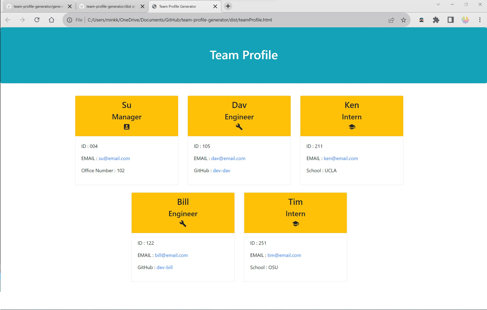

# Project Title [ Team-Profile-Generator ]

-----

## Table of Contents
1. [Description](#description)
2. [Installation](#installation)
3. [Usage](#usage)
4. [Contributing](#contributing)
5. [Tests](#tests)
6. [License](#license)
7. [Questions](#questions)

-----

Walk-Through Video URL: https://drive.google.com/file/d/1oHEglGgSjGcJnCVDmcp3uQPlhPzG3kIa/view

### Description 
Build a Node.js command-line application that takes in information about employees on a software engineering team and generates an HTML webpage that displays summaries for each employee. 

-----

### Installation 
Inquirer, Node.js, Jest

-----

### Usage 
AS A manager
I WANT to generate a webpage that displays my team's basic info
SO THAT I have quick access to their emails and GitHub profiles

-----

### Contributing 
YES 

-----

### Tests 
Install NPM Jest, Run Test 

-----

### License 
MIT 

-----

### Questions 

#### GitHub Username: min-hinthar 

#### Repo URL: https://github.com/min-hinthar/team-profile-generator

#### Email: min@hintharinc.com

-----

